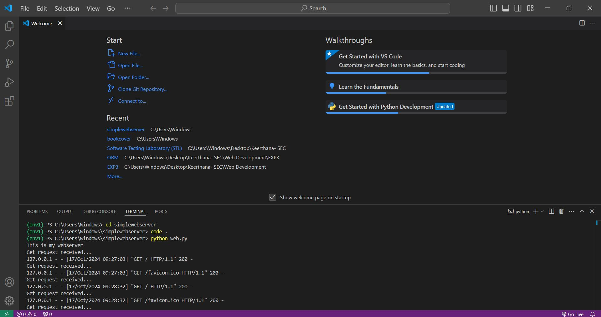
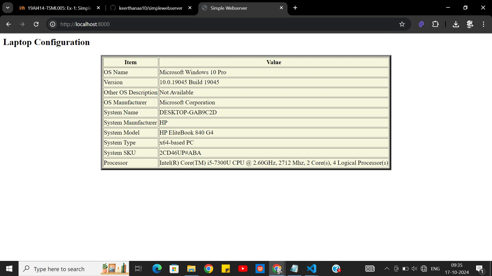

# EX-1 Developing a Simple Webserver
## Date: 17/10/2024

## AIM:
To develop a simple webserver to serve html pages and display the configuration details of laptop.

## DESIGN STEPS:
### Step 1: 
HTML content creation.

### Step 2:
Design of webserver workflow.

### Step 3:
Implementation using Python code.

### Step 4:
Serving the HTML pages.

### Step 5:
Testing the webserver.

## PROGRAM:
```
import platform
from http.server import HTTPServer,BaseHTTPRequestHandler

system_name = platform.system()
node_name = platform.node()
release = platform.release()
version = platform.version()
machine = platform.machine()
processor = platform.processor()

content='''
<html>
   <head>
      <title>Simple Webserver</title>
   </head>
    <body>
      <h2>
      Laptop Configuration <br> By Keerthana R
      <h2>
      <h3>
        <table border="5" cellpadding align="center" bgcolor="beige" height="300" widhth="500">
            <tr>
                <th>Item</th>
                <th> Value</th>
            </tr>

            <tr>
                <td>OS Name</td>
                <td>Microsoft Windows 10 Pro</td>
            </tr>

            <tr>
                <td>Version	</td>
                <td>10.0.19045 Build 19045</td>
            </tr>

            <tr>
                <td>Other OS Description</td>
                <td>Not Available</td>
            </tr>

            <tr>
                <td>OS Manufacturer</td>
                <td>Microsoft Corporation</td>
            </tr>

            <tr>
                <td>System Name</td>
                <td>DESKTOP-GAB9C2D</td>
            </tr>

            <tr>
                <td>System Manufacturer</td>
                <td>HP</td>
            </tr>

            <tr>
                <td>System Model</td>
                <td>HP EliteBook 840 G4</td>
            </tr>

            <tr>
                <td>System Type</td>
                <td>x64-based PC</td>
            </tr>

            <tr>
                <td>System SKU</td>
                <td>2CD46UP#ABA</td>
            </tr>

            <tr>
                <td>Processor</td>
                <td>Intel(R) Core(TM) i5-7300U CPU @ 2.60GHz, 2712 Mhz, 2 Core(s), 4 Logical Processor(s)</td>
            </tr>

      </h3>
   </body>
</html>
'''

class MyServer(BaseHTTPRequestHandler):
    def do_GET(self):
        print("Get request received...")
        self.send_response(200) 
        self.send_header("content-type", "text/html")       
        self.end_headers()
        self.wfile.write(content.encode())

print("This is my webserver") 
server_address =('',8000)
httpd = HTTPServer(server_address,MyServer)
httpd.serve_forever()

```

## OUTPUT:





## RESULT:
The program for implementing simple webserver is executed successfully.
